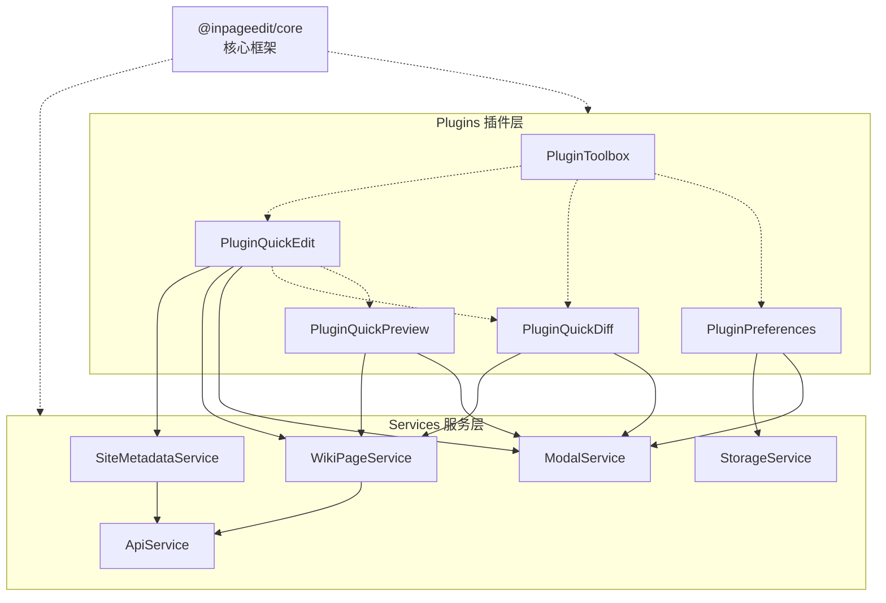

# 开发者指南

本指南将帮助您了解如何为 InPageEdit NEXT 开发插件和扩展功能。

::: tip

**本指南假设您已经熟悉 JavaScript、DOM API、Node.js 等前端开发基础知识，并且对于 MediaWiki 的 HTTP API 有一定的了解。**

你 _不一定_ 需要 TypeScript 的经验，但是我们偶尔会使用 TypeScript 来展示接口和类型定义，因此稍微学习一下 TypeScript 会对你有所帮助。

作为示例，你可以把鼠标放在下面的代码上，查看类型推导：

```ts twoslash
mw.hook('InPageEdit.ready').add((ipe) => {
  ipe.plugin((ctx) => {
    console.log(ctx, 'hello, world')
    //          ^?
  })
})
```

:::

## 重新认识 InPageEdit

InPageEdit NEXT 最熟为人知的功能是“快速编辑”。

但你也许想不到的是，IPE本身是一个巨大的元框架，它的核心仅仅是一个提供基于依赖注入、事件总线、状态管理、异步任务调度等基础功能的框架。

即便是核心功能“快速编辑”，也仅仅是一个基于事件总线的插件，它并不关心wiki配置，也不关心页面内容，它只是基于 SiteMetadataService + WikiPageService 服务提供的数据，显示了一个编辑框，而预览、保存编辑内容也并非由它负责。



看上去有点乱七八糟的？没关系，接下来的章节会逐步为你揭开 InPageEdit NEXT 的神秘面纱。

- [插件101](plugins-101/1.first-plugin.md) 一章将带你从零开始，开发你的第一个插件。
- [参与核心开发](contribute-to-core/1.start.md) 一章将带你了解 InPageEdit NEXT 的代码结构，参与核心功能的开发或错误修复。
- [API参考](api-references/index.md) 一章将为你介绍所有核心服务和插件的API。

## 🔗 相关资源

- [TypeScript 官方文档](https://www.typescriptlang.org/)
- [JSX-DOM](https://npmjs.com/package/jsx-dom)
- [MediaWiki API 文档](https://www.mediawiki.org/wiki/API:Main_page)
- [GitHub 仓库](https://github.com/inpageedit/inpageedit-next)
- [问题反馈](https://github.com/inpageedit/inpageedit-next/issues)
