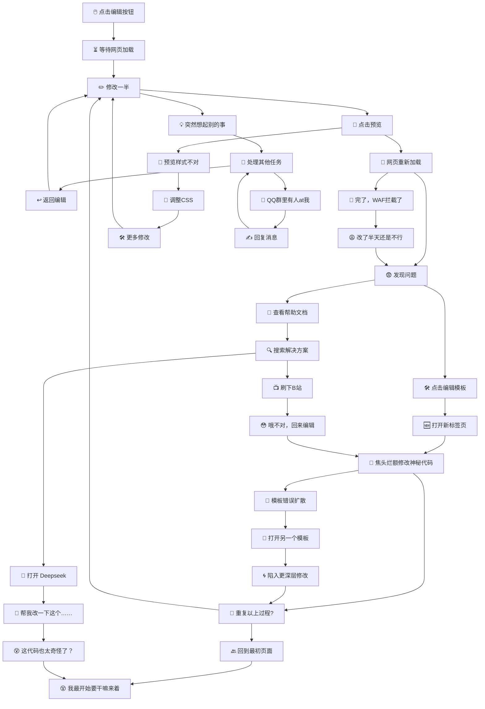
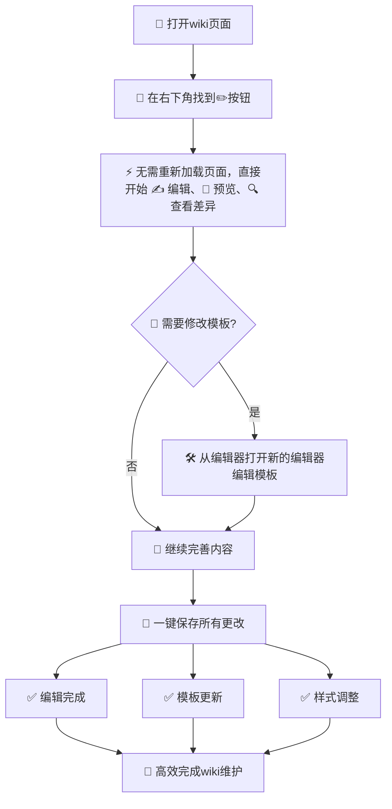

# 种草指南

## 何谓 InPageEdit NEXT？

InPageEdit NEXT 是 InPageEdit 的下一代版本，它基于 TypeScript 重新组织了应用逻辑，提供了更现代的开发体验和更强大的功能。

它与 InPageEdit-v2 相比，更加强大💪🏻！

## 为什么选择 InPageEdit？

### 情景假设

想象一下这个场景……

你打开了 wiki，发现这个条目里有点小问题，让我们点击编辑按钮：

### 一切却能如此……

如果你安装了 InPageEdit，情况是怎么样的呢……

我们在这里还只是假设了一种使用场景，而 InPageEdit 提供的功能远比“编辑一个 wiki 页面”要多得多！

## 太长不看，告诉我怎么安装？

甭急，我们马上就讲到 → [安装方法](installation.md)
